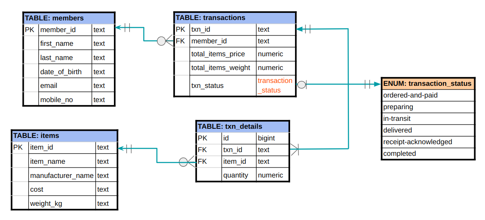
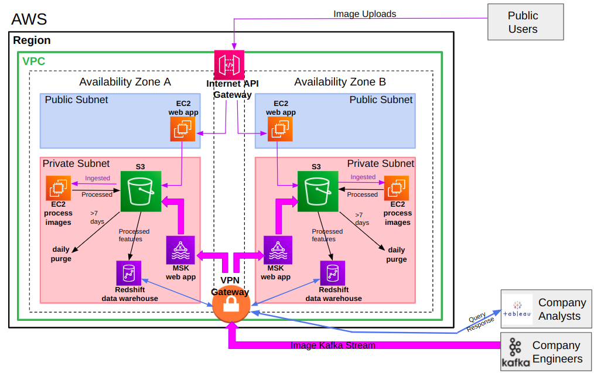

# Senior Data Enginer Tech Challenge: Submission
---
The submission is split into 5 sections:
1. Data Pipelines
2. Databases 
3. System Design
4. Charts & APIs
5. Machine Learning

All codes are implemented on an Ubuntu 20.04.5 LTS laptop with the following installed:
- Docker version 20.10.21
- docker-compose version 1.29.2

All codes and data are stored in a NTFS formated D:drive that is mounted onto the Ubuntu partition.

---

## Section 1: Data Pipelines
The required data pipeline is implemented using airflow via docker containers using the following Docker images:
- apache/airflow:2.4.3-python3.9
- postgres:15.1

### Scripts
The relevant Python scripts for the data pipeline are located at:
- airflow/dags/data_pipeline.py
- airflow/plugins/dataproc_config.py
- airflow/plugins/preprocess.py

### Execution Steps
#### (A) Start and run all of the containers used in the stack
    docker-compose up -d

#### (B) Verify that the airflow-scheduler container is ready
    docker logs airflow-scheduler 

Once ready, you should see two log entries of "Booting worker with pid" and one log entry with "Launched DagFileProcessorManager"

#### (C) Access the airflow stack
Once the airflow-scheduler is ready, the stack can be accessed on http://localhost:8080.
- Log in using the default username "airflow" and default password "airflow". 
- You should see one "data_pipeline_dag" in the DAGs page (see screenshot below).
- Refer to schedule, which is set as "15 * * * *", which means every hour at 15 minutes past the hour.
- Refer to next run for the datetime of the next scheduled run, which is set at 2022-12-22, 00:15.
- The "data_pipeline_dag" can be executed manually by pressing the "play" button under "Actions", followed by "Trigger DAG", which will generate the logs and outputs.
<p align = "center">

</p>
<p align = "center">
Fig.1 - Airflow Screenshot
</p>
<!--  -->

#### (D) Input Raw Data
The input raw application data are located within the "data/raw" folder.

#### (E) Outputs
The processed data for successful and failed applications from each application dataset have been uploaded here and are located in the folders:
- "outputs/successful"
- "outputs/failed"

#### (F) Logs
The data pipeline logs are stored under "airflow/logs/dag_id=data_pipeline_dag" with a separate log folder for each task as follows:
- task_id=task_id=ingest_and_process
- task_id=validity_check
Sample logs have been uploaed here under the same folder structure.

#### (G) Tear down the airflow stack gracefully
    docker-compose down -v

---

## Section 2: Databases

## Part 1: Setup sales transactions database for an e-commerce company
The required database for sales transactions is implemented via a postgres:15.1 Docker container. Additions have been made to the docker-compose.yml file used in Section 1 to start up the database service (container name db1) with the setup.sql file mounted inside the /docker-entrypoint-initdb.d directory within the container. This setup.sql file contains all relevant DDL statements needed to create an admin user ("dbadmin"), the sales database and associated tables. See ERD below for the tables created and their relationships. 

### Entity Relationship Diagram (ERD)
<p align = "center">

</p>
<p align = "center">
Fig.2 - ERD for "sales" Database
</p>
<!--  -->

### SQL Scripts
You can find the setup.sql file with the DDL statements at the location "database/setup.sql".

### Execution Steps
#### (A) Start the database docker container "db1" (along with other containers)
    docker-compose up -d

#### (B) View the logs associated with the database and table creation inside the docker container "db1"
    docker logs db1

#### (C) Enter into container db1, and then into postgres to view the tables created.
    docker exec -it db1 /bin/bash

#### (D) Connect to the sales database using the "dbadmin" user
    psql -d sales -U dbadmin

#### (E) List tables created in the sales database
    \dt

#### (F) View each table using SQL.
    select * from <table_name>;

#### (G) Exit psql and then exit the "db1" docker container.
    \q
    exit

#### (H) Tear down the docker containers gracefully
    docker-compose down -v


## Part 2: Write SQL Statements for the following questions.

### Q1. Which are the top 10 members by spending?
```
SELECT transactions.member_id, members.first_name, members.last_name, sum(transactions.total_items_price) as total_spending
FROM transactions
INNER JOIN members
ON transactions.member_id = members.member_id
GROUP BY (transactions.member_id, members.first_name, members.last_name)
ORDER BY total_spending DESC
LIMIT 10;
```

### Q2. Which are the top 3 items that are frequently brought by members?
```
SELECT txn_details.item_id, items.item_name, sum(txn_details.quantity) as total_quantity
FROM txn_details
INNER JOIN items
ON txn_details.item_id = items.item_id
GROUP BY (txn_details.item_id, items.item_name)
ORDER BY total_quantity DESC
LIMIT 3;
```

The above SQL commands have also been added to the end of the setup.sql file. The outputs from the above queries can be viewed inside the logs for the database container. 

    docker logs db1

---

## Section 3: System Design

## Design 1
A role based access strategy will be suitable to meet the needs of the following teams:
- Logistics: 
    - Get the sales details (in particular the weight of the total items bought)
    - Update the table for completed transactions
- Analytics:
    - Perform analysis on the sales and membership status
    - Should not be able to perform updates on any tables
- Sales:
    - Update database with new items
    - Remove old items from database

The database/setup.sql file in Section 2 has been updated to implement the role based access strategy, One group role is created for each team above. Each group role is granted relevant permissions on specific tables to meet their needs as described below. 
-   logistics_user
```
CREATE ROLE logistics_user;
GRANT SELECT on items, txn_details, transactions to logistics_user;
GRANT INSERT, UPDATE on transactions to logistics_user;
```
-   analytics_user
```
CREATE ROLE analytics_user;
GRANT SELECT on members, items, transactions, txn_details to analytics_user;
```
-   sales_user
```
CREATE ROLE sales_user;
GRANT SELECT, INSERT, UPDATE, DELETE on items to sales_user;
```

Thereafter, users can be created for specific members of each team, then assigned to their respective group roles to obtain the relevant permissions (see example SQL code below).

```
CREATE USER log_user1 WITH ENCRYPTED PASSWORD 'log_user1';
CREATE USER ana_user1 WITH ENCRYPTED PASSWORD 'ana_user1';
CREATE USER sal_user1 WITH ENCRYPTED PASSWORD 'sal_user1';
GRANT logistics_user to log_user1;
GRANT analytics_user to ana_user1;
GRANT sales_user to sal_user1;
```

## Design 2

### AWS System Architecture

<p align = "center">

</p>
<p align = "center">
Fig.3 - AWS System Architecture Designed for the image processing company. 
</p>
<!--  -->

#### Assumptions
- Company engineers use Apache Kafka to upload images.
- The proceessed data is in a ready form to be copied to a Redshift data warehouse for business analysis. 
- Company analysts use Tableau to perform analysis on the processed data (e.g. features derived from image processing).
- Company has its own identify provider to provide a single-source of truth for all employee identities. 

#### Overview
- An AWS VPC (virtual private cloud) spanning at least two availability zones in the company's region can be used to host the company's web annd image processing applications in the cloud. Each availability zone should also have at least two public subnets and two private subnets (only one is shown in Figure 3 due to space constraints). These best practices provide redundancy at the availability zone and subnet level for the gateways (both internet and private) to route traffic to, which enables high availability, fault tolerance and disaster recovery should any of the subnets or availability zone fail.
- Images uploaded by public users via an API will be routed by the internet API gateway to the EC2 (Elastic Compute Cloud) web appplication instance hosted on one of the public subnets. The EC2 web application will then store the ingested images and associated meta-data into an S3 object store in the company's region.
- Images uploaded by the Kafka stream managed by company engineers will be routed by a VPN gateway to the MSK (Managed Streaming for Apache Kakfa) web application instance hosted on one of the private subnets. The MSK web application will then store the ingested images and associated meta-data into S3.
- Another EC2 instance hosted on the same private subnet then ingests the stored images and meta-data from S3, applies the company's proprietary image processing algorithm, and then uploads the processed data back to S3.
- Objects stored in S3 are redundantly stored across multiple devices, across multiple Availability Zones. This provides a very high level of durability and availability, which makes S3 ideal for archiving both the ingested and processed data.
- An expiration action can be set for S3 to automatically delete specific objects (i.e. images, meta-data) that are more than 7 days old for compliance and privacy.
- An Redshift data warehouse instance can ingest relevant processed data (e.g. features derived from image processing) from S3 to serve as a business intellence resource for company analysts to access via the VPN gateway. Company analysts can also eaily connect Tableau to Redshift to access the data and perform relevant computations for business dashboards. If further transformations on the processed data is required before ingestion into Redshift, an AWS Glue service can be implemented in between S3 and Redshift to perform the relevant transformations before storing into Redshift.

#### Role Based Secure Access to AWS Environment and Resources
- Different AWS IAM (Identity and Access Management) roles can be created for the company's employees (e.g. engineers, analysts) with differnt roles, as well as for the different services running on the VPC to secure secured. Different IAM policies can be attached to each IAM role with permissions to access only the resources each role requires (least priviledge). Relevant IAM roles can be assigned to employees from different groups, based on their identities federated from the company's identity provider. As the company expands, maintaining IAM roles is more efficient and secure than creating IAM user identties for each employee. This is because
    - IAM roles can be assigned programmatically to access requests made through the company's identity provider 
    - IAM role login credentials are assigned programmatically and expire after a defined period of time (up to 36 hours), while IAM user credentials are long term.
    - IAM role credentials can be rotated after expiry which is more robust and efficient than IAM users forced to manually change passwords after a pre-set password expiry duration.

#### Data Security at Rest and in-Transit
- Server side encryption can be set for both S3 and Redshift to secure stored data at rest. 
- Secure Sockets Layer (SSL) can be used to secure data in transit whereby encryption algorithms are used to scramble data exchanged via HTTPs URLs between public users/company employees and the AWS VPC.

#### Scaling to meet user demand while keeping costs low
- The elastic nature of compute (e.g. EC2, MSK) and storage (e.g. S3, EBS) on AWS allows the company to scale easily as user demand grows and to manage costs by only paying for extra resources when there is real demand. 
- MSK can be provisioned with increased EBS (Elastic Bloc Store) volumes to provide a larger data retention buffer, in case of failures while handling larger Kafka streams. 
- S3 is a low cost way to scale up and handle the larger data sizes from more images as user demand increases. If storage costs become too high, a transition action can be set to speed up transition of images that have been processed to lower cost S3 tiers (e.g. infrequent-access, one-zone-infrequent-access or glacier) before they are purged.
- Redshift data warehouse is designed to maintain low latency as it holds more structured data.
- As the company scales up, it can gather data on the usage levels for each service and further optimize costs subscribing to lower price AWS packages that commit to a certain level of usage, as opposed to paying for every service on-demand. 

#### Maintenance of environment and assets
- Serverless architecture variants can be chosen for the MSK and EC2 web apps, and the Redshift data-store to offload the server environment management to AWS. The serverless variants typically expose a RESTful API through the internet or VPN gateways for responding to requests. For the web apps, the serverless alternatives are paired with
    - AWS Amplify Console to provide continuous deployment and hosting of static web resources (e.g. HTML, CSS, JavaScript, image files) that are loaded on the client's browser
    - Amazon Cognito to provide user management and authentication
- Housekeeping of the stored images and meta-data are already handled by the expiration action set in S3.
- AWS S3 supports versioning. Hence, git repositories can be set up such that the company's processing scripts are uploaded, stored and versioned on S3 as CI/CD (continuous integration/continuous delivery) proceeds.

---

## Section 4: Charts and APIs

### Screenshot of Dashboard
<p align = "center">

</p>
<p align = "center">
Fig.4 - Screenshot of Covid-19 Statistics Dashboard. 
</p>

The required Covid-19 statistics dashboard is implemented using Flask and Plotly.dash via a docker container using a custom Docker image (app_frontend:7). The relevant Dockerfile and requirements.txt file are included in the "dashboard" directory of this repo for building the docker image, if necessary. The "docker-compose.yml" file is also updated to start up the dashboard container.

### Execution Steps

#### (A) Build docker image and start the dashboard container "dashboard1" (along with other containers)
    docker-compose up -d

#### (B) Verify that the dashboard container is ready
    docker logs dashboard1

Once ready, you should see one log entry of "Booting worker with pid" at the end.

#### (C) View dashboard on a web-browser (e.g. Chrome) at http://localhost:8050/dashboard
It may take a while before the chart shows. Behind the scenes, an API request is made to https://api.covid19api.com/country/singapore/status/confirmed and the returned data is loaded into a pandas Dataframe. A new column "Daily Cases" is computed by taking the difference between consecutive rows of the "Cases" column. Finally, the count of "Daily Cases" is then plotted against "Date" as a bar chart via plotly.express, and rendered on the dashboard. 

#### (D) Tear down the docker containers gracefully
    docker-compose down -v

---

## Section 5: Machine Learning

This coding for this section is implemented using Jupyter Notebook inside a docker container using the Docker image jupyter/datascience-notebook:notebook-6.5.2. The "docker-compose.yml" file is updated to start up an "ml" service with container name "jupyter1". 

The data is located at
- ml/data

The relevant codes are located at
- ml/notebooks/train_model.ipynb
- ml/src/ml_preprocess.py

Details of the data exploration, preprocessing (ordinal and onehot encoding, using KMeans to get clustering label as feature), model training and evaluation, applying the model to predict on the given sample are in the ml/notebooks/train_model.ipynb file.

A gradient boosted regression model is fitted and the predicted buying price for the given sample is "low".